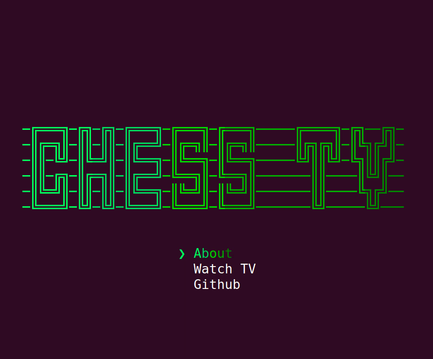

# Terminal Chess TV

Continuously shows ongoing high-rated blitz games from [Lichess](https://lichess.org) in your terminal.

An excuse for playing around with [ink](https://github.com/vadimdemedes/ink) and [React](https://reactjs.org).

## How to run

`npx terminal-chess-tv`

or 

`npm -g terminal-chess-tv`

## Notes

- Not tested in many different terminals!

## TODOs

- Add board flip control
- Add board labels on edge (i.e. 1-8, A-H)
- Add colour controls to allow game to work in non-dark terminals
